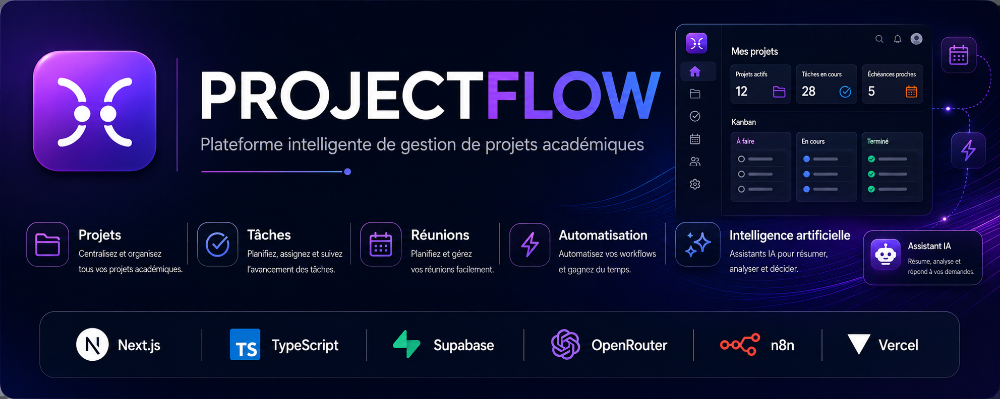

<p align="center">
  
</p>
<h1 align="center">ProjectFlow</h1>

<p align="center">
  <strong>Plateforme intelligente de gestion de projets académiques</strong>
</p>

<p align="center">
  Centralisez vos projets, organisez vos tâches et réunions, automatisez vos workflows
  et exploitez l'intelligence artificielle pour mieux planifier, résumer et décider.
</p>

<p align="center">
  <a href="https://project-flow-omega-khaki.vercel.app/">
    🌐 Voir l'application
  </a>
</p>
<p align="center">
  
  
  
  
  
  
  
</p>


## 📌 À propos de ProjectFlow

**ProjectFlow** est une plateforme web intelligente conçue pour simplifier la gestion des projets académiques au sein d'un espace centralisé.

Elle permet aux étudiants de structurer leurs projets, organiser leurs tâches, planifier leurs réunions, suivre leurs échéances et conserver les informations importantes liées à leur travail.

Au-delà de la gestion classique, ProjectFlow intègre une couche d'**intelligence artificielle** capable notamment de générer des checklists, produire des résumés intelligents de projets et de réunions, et accompagner l'utilisateur grâce à un assistant conversationnel intégré.

La plateforme combine également des **automatisations** afin de réduire les tâches répétitives et d'améliorer le suivi des activités académiques.

---

## ✨ Fonctionnalités principales

### 📁 Gestion des projets
- Création, modification et suppression de projets
- Suivi du statut et des échéances
- Visualisation de la progression des projets
- Pages détaillées regroupant toutes les informations d'un projet

### ✅ Gestion des tâches
- Organisation des tâches par projet
- Priorités et dates d'échéance
- Suivi par statut : À faire, En cours et Terminé
- Vue Kanban pour visualiser facilement l'avancement

### 📅 Réunions
- Planification et suivi des réunions
- Association des réunions aux projets
- Gestion du statut des réunions
- Centralisation des informations et comptes rendus

### 🤖 Intelligence artificielle
- Génération intelligente de checklists
- Résumés structurés des projets
- Résumés et comptes rendus de réunions
- Assistant IA conversationnel intégré à ProjectFlow
- Analyse du contexte des projets, tâches et échéances

### ⚡ Automatisations
- Workflows automatisés avec n8n
- Notifications et rappels liés aux activités
- Automatisation de certaines communications par e-mail

### 📎 Collaboration et suivi
- Pièces jointes
- Commentaires
- Historique des activités
- Notifications
- Recherche globale
- Tableau de bord avec statistiques et indicateurs de progression

### 🌙 Expérience utilisateur
- Interface responsive et moderne
- Mode clair et mode sombre
- Design System cohérent dans toute l'application
- Navigation centralisée et raccourcis de recherche

---

## 🛠️ Stack technique

ProjectFlow repose sur une architecture web moderne combinant développement full-stack, base de données cloud, intelligence artificielle, automatisation et déploiement continu.

| Technologie | Rôle dans ProjectFlow |
|---|---|
| **Next.js 16** | Framework principal et architecture de l'application |
| **React 19** | Construction de l'interface utilisateur |
| **TypeScript** | Typage et fiabilité du code |
| **Tailwind CSS** | Design System et interface responsive |
| **Supabase** | Base de données, authentification et stockage |
| **OpenRouter** | Accès aux modèles d'intelligence artificielle |
| **n8n** | Automatisation des workflows |
| **Vercel** | Hébergement et déploiement continu |
| **GitHub** | Versionnement et gestion du code source |

---

## 🏗️ Architecture

ProjectFlow est construit autour d'une architecture modulaire afin de séparer clairement l'interface utilisateur, la logique métier, les données, l'intelligence artificielle et les automatisations.

```text
ProjectFlow
│
├── app/              → Pages, layouts et routes API Next.js
├── components/       → Composants UI et fonctionnalités réutilisables
├── hooks/            → Hooks React personnalisés
├── services/         → Accès aux données et logique métier
├── lib/              → Utilitaires, configuration et services IA
├── types/            → Types TypeScript
├── supabase/         → Scripts et structure de la base de données
├── n8n/              → Workflows d'automatisation
└── public/           → Ressources statiques et identité visuelle

```

## 🚀 Installation et lancement

### Prérequis

Avant de lancer ProjectFlow, assurez-vous d'avoir installé :

- **Node.js 20+**
- **npm**
- **Git**
- Un projet **Supabase**

### 1. Cloner le projet

```bash
git clone https://github.com/moribatoure750/ProjectFlow.git
cd ProjectFlow
```


### 2. Installer les dépendances

```bash
npm install
```

### 3. Configurer les variables d'environnement

Créez un fichier `.env.local` à la racine du projet et configurez les variables nécessaires à ProjectFlow.

> ⚠️ Les clés API et autres secrets ne doivent jamais être ajoutés au dépôt GitHub.

### 4. Lancer l'application

```bash
npm run dev
```

L'application est ensuite accessible sur :

```text
http://localhost:3000
```

---

## ⚙️ Configuration

ProjectFlow utilise des variables d'environnement pour connecter l'application à **Supabase** et au fournisseur d'intelligence artificielle.

Créez un fichier `.env.local` à la racine du projet :

```env
# Supabase
NEXT_PUBLIC_SUPABASE_URL=votre_url_supabase
NEXT_PUBLIC_SUPABASE_ANON_KEY=votre_cle_anonyme_supabase

# Intelligence artificielle
AI_API_KEY=votre_cle_api
AI_MODEL=votre_modele
AI_BASE_URL=https://votre-fournisseur.example.com/v1
```

### Supabase

Les variables Supabase permettent à ProjectFlow d'accéder à la base de données et aux services d'authentification.

- `NEXT_PUBLIC_SUPABASE_URL` — URL du projet Supabase
- `NEXT_PUBLIC_SUPABASE_ANON_KEY` — clé publique anonyme du projet

### Intelligence artificielle

ProjectFlow utilise une API compatible avec le format OpenAI pour ses fonctionnalités d'intelligence artificielle.

- `AI_API_KEY` — clé API du fournisseur IA
- `AI_MODEL` — modèle utilisé par ProjectFlow
- `AI_BASE_URL` — URL de base de l'API du fournisseur

> 🔐 **Sécurité :** ne publiez jamais votre fichier `.env.local`, vos clés API ou d'autres secrets dans le dépôt GitHub.

---

## 🗄️ Base de données

ProjectFlow utilise **Supabase (PostgreSQL)** pour stocker et gérer les données de l'application.

Les principales entités sont :

- **Projets** — informations générales, descriptions, statuts et échéances
- **Tâches** — tâches associées aux projets, priorités, statuts et dates d'échéance
- **Réunions** — réunions liées aux projets et informations de suivi
- **Commentaires** — échanges et informations associés aux éléments de travail
- **Pièces jointes** — fichiers associés aux différents éléments de l'application
- **Activités** — historique des actions importantes réalisées dans ProjectFlow

L'accès aux données est sécurisé grâce à l'authentification Supabase et aux politiques de sécurité au niveau des lignes (**Row Level Security — RLS**).

Les scripts SQL nécessaires à la structure et aux fonctionnalités de la base de données sont regroupés dans le dossier :

```text
supabase/

```

## 🤖 Intelligence artificielle

ProjectFlow intègre une couche d'**intelligence artificielle** destinée à assister l'utilisateur dans la gestion et le suivi de ses projets académiques.

### Fonctionnalités IA

- **Génération de checklists** — transforme un objectif ou un projet en étapes concrètes et structurées
- **Résumé intelligent de projet** — analyse l'état d'un projet et génère un rapport comprenant progression, points positifs, risques, recommandations et prochaines étapes
- **Résumé de réunion** — génère un compte rendu structuré à partir des informations d'une réunion
- **Assistant conversationnel ProjectFlow** — permet d'interroger l'application en langage naturel et d'obtenir des recommandations contextualisées
- **Analyse des priorités et échéances** — aide à identifier les tâches importantes, les retards et les risques potentiels

### Architecture IA

Les fonctionnalités IA communiquent avec le fournisseur de modèles via une API **compatible OpenAI**.

Dans la configuration actuelle de ProjectFlow, **OpenRouter** est utilisé comme passerelle vers les modèles d'intelligence artificielle.

```text
Utilisateur
    │
    ▼
Interface ProjectFlow
    │
    ▼
Routes API Next.js
    │
    ▼
Couche IA ProjectFlow
    │
    ▼
OpenRouter
    │
    ▼
Modèle d'intelligence artificielle

```

## ⚡ Automatisations

ProjectFlow intègre **n8n** afin d'automatiser certaines tâches répétitives et d'améliorer le suivi des activités académiques.

### Workflows

Les automatisations permettent notamment de :

- **Rappeler les échéances importantes** liées aux projets et aux tâches
- **Envoyer des notifications par e-mail** selon les événements détectés
- **Suivre automatiquement certaines activités** de ProjectFlow
- **Réduire les tâches répétitives** grâce à des workflows automatisés

### Architecture des automatisations

```text
ProjectFlow
    │
    ▼
Supabase
    │
    ▼
n8n
    │
    ├── Analyse des événements
    │
    ├── Vérification des conditions
    │
    └── Déclenchement des workflows
                │
                ▼
        Notifications / E-mails

```

## 🔐 Sécurité

La sécurité des données et des accès fait partie intégrante de l'architecture de ProjectFlow.

Les principaux mécanismes mis en place sont :

- **Authentification Supabase** pour la gestion des comptes utilisateurs
- **Row Level Security (RLS)** pour isoler les données entre les utilisateurs
- **Variables d'environnement** pour protéger les informations sensibles
- **Clés API IA conservées côté serveur** et jamais exposées directement au navigateur
- **Contrôle d'accès aux données** selon l'utilisateur authentifié
- **Séparation entre configuration publique et secrets serveur**

> 🔒 Les fichiers contenant des secrets, notamment `.env.local`, ne doivent jamais être ajoutés au dépôt GitHub.

Aucune clé API, aucun mot de passe ni aucun secret de production ne doit être stocké directement dans le code source.

---

## 🚀 Déploiement

ProjectFlow est déployé sur **Vercel** avec un déploiement continu connecté au dépôt GitHub.

### Application en ligne

🌐 **ProjectFlow :**  
https://project-flow-omega-khaki.vercel.app/

### Processus de déploiement

```text
Développement local
        │
        ▼
      Git
        │
        ▼
     GitHub
        │
        ▼
     Vercel
        │
        ▼
ProjectFlow en production

```

## 🏷️ Statut du projet

**ProjectFlow est actuellement en Release Candidate (RC).**

La version actuelle regroupe les principales fonctionnalités prévues pour le projet :

- ✅ Gestion des projets
- ✅ Gestion des tâches et suivi Kanban
- ✅ Gestion et planification des réunions
- ✅ Tableau de bord et statistiques
- ✅ Authentification et isolation des données utilisateurs
- ✅ Pièces jointes, commentaires et historique d'activité
- ✅ Notifications
- ✅ Intelligence artificielle et assistant conversationnel
- ✅ Automatisations avec n8n
- ✅ Interface responsive
- ✅ Dark Mode
- ✅ Déploiement continu sur Vercel

> 🚀 La Release Candidate représente une version fonctionnelle et stabilisée de ProjectFlow, prête pour les dernières validations avant une version finale.

---

## 👨‍💻 Auteur

**Moriba Touré**

Étudiant au **baccalauréat en informatique à l'Université du Québec à Rimouski (UQAR)**.

ProjectFlow a été développé dans le cadre d'un **projet académique de 6 crédits**, avec pour objectif de concevoir une application web moderne combinant développement full-stack, gestion de données, intelligence artificielle et automatisation.

### Liens

- **GitHub :** [moribatoure750](https://github.com/moribatoure750)
- **Application :** [ProjectFlow](https://project-flow-omega-khaki.vercel.app/)

---

## 📄 Licence et utilisation

ProjectFlow est actuellement développé dans un **contexte académique**.

Le code source est rendu public à des fins de **présentation, d'apprentissage et de démonstration du projet**.

Aucune licence open source spécifique n'est actuellement associée au dépôt.

---

<p align="center">
  Développé avec ❤️ dans le cadre du projet <strong>ProjectFlow</strong>
</p>

<p align="center">
  <strong>Next.js • TypeScript • Supabase • OpenRouter • n8n • Vercel</strong>
</p>